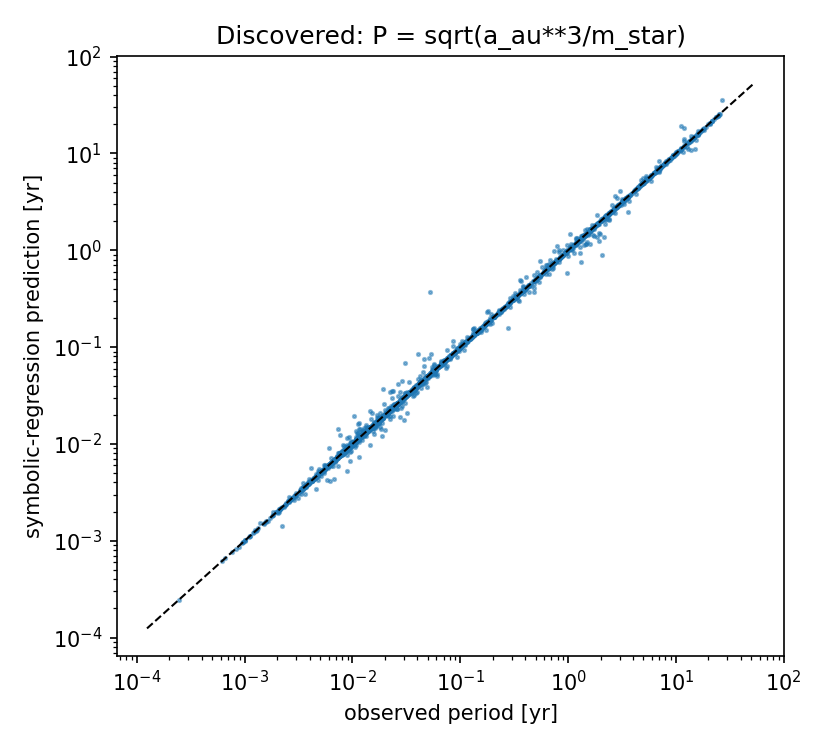
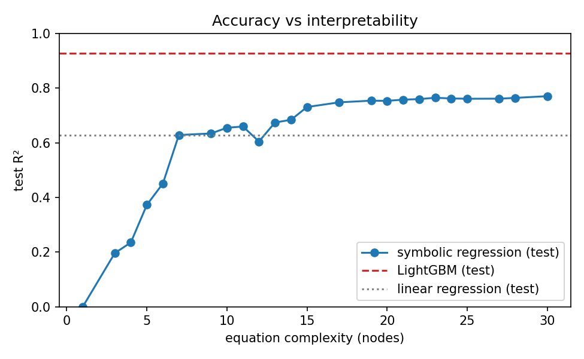
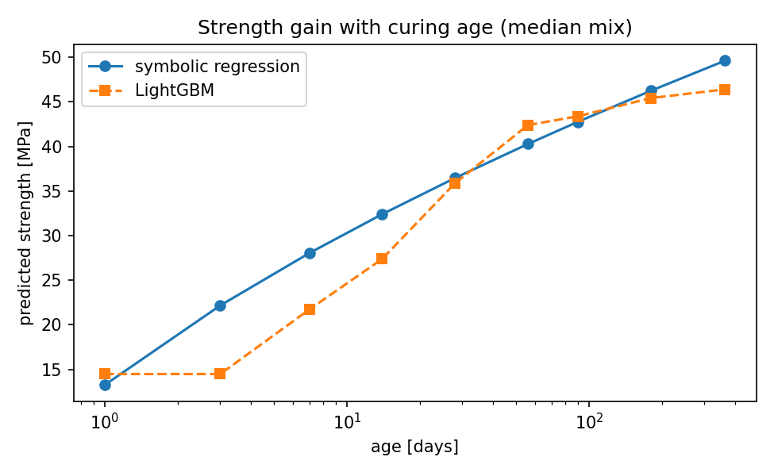

# Symbolic Regression Insights

**Symbolic regression** searches for a mathematical formula that fits the data, instead of fitting parameters of
a fixed model. The output is an equation a person can read, check against domain knowledge and put in a
spreadsheet. This repo applies [PySR](https://github.com/MilesCranmer/PySR) to two public datasets and asks the
practical question: **what do we gain, and what do we give up, by choosing an interpretable formula?**

## Case 1: rediscovering Kepler's third law from real exoplanets

Input: orbital period, semi-major axis and host-star mass for **2,843 planets** from the
[NASA Exoplanet Archive](https://exoplanetarchive.ipac.caltech.edu/). No physics is given to the search.

| | Result |
|---|---|
| Equation found | `P = sqrt(a^3 / M)`: exactly Newton's form of Kepler's third law |
| Median relative error | 0.19% |
| Log-log OLS exponents (95% CI) | a: 1.498 (1.496 to 1.500) · M: -0.480 (-0.488 to -0.471) |
| Bootstrap refits (3) | same law; 2 of 3 add a small constant to the star mass, `sqrt(a^3/(M + 0.025))` |



Reading the results carefully:
- The stellar-mass exponent is slightly below 0.5 in absolute value. This is what measurement error in
  stellar masses produces (errors-in-variables attenuates a regression coefficient toward zero), which is a
  useful reminder that a formula search and a statistical fit answer different questions.
- **Caveat:** for many transiting planets, the archive *derives* the semi-major axis from the period and
  stellar mass using Kepler's law itself. This case is therefore a **sanity check of the method** (can the search
  find a known law in real, messy data with no prior?) rather than an independent test of physics.

## Case 2: concrete compressive strength, formula vs black box

[UCI Concrete Compressive Strength](https://archive.ics.uci.edu/dataset/165/concrete+compressive+strength): 1,030
mixes, 8 inputs (cement, slag, fly ash, water, superplasticizer, aggregates, age). 80/20 train/test split.

| Model | Test R² | Test RMSE (MPa) | What you get |
|---|---|---|---|
| Linear regression | 0.63 | 9.8 | 9 coefficients |
| **Symbolic regression** | **0.73** | **8.3** | one formula using 4 of 8 inputs (below) |
| LightGBM | 0.93 | 4.3 | 600 trees |

Selected equation (complexity 15):

```
strength ≈ sqrt( (2.48·cement + slag) · log(age · (superplasticizer + 2.48)) ) - 25.7
```



- A **7-node formula** (`superplasticizer + sqrt(log(age) · cement)`) already matches linear regression with 8 inputs.
- The formula recovers known concrete behavior: strength grows with the **logarithm of curing age**, cement
  counts about 2.5x as much as slag, and superplasticizer amplifies early strength.
- The honest trade-off: the gradient-boosting model is far more accurate (R² 0.93). Use it when accuracy is the
  only goal; use the formula to explain, to sanity-check the black box, or where a model must be auditable.



## Run it

```bash
pip install -r requirements.txt       # PySR installs Julia automatically on first use
python scripts/kepler.py              # ~5 min
python scripts/concrete.py            # ~15 min, single-threaded and deterministic
pytest -q
```

## Structure

```
src/sr_insights/data.py       NASA and UCI loaders
src/sr_insights/modeling.py   PySR configuration, metrics, power-law fit with CIs, Pareto front, bootstrap refits
scripts/kepler.py             case 1
scripts/concrete.py           case 2
reports/                      JSON results, Pareto front CSV, figures
```

## Author

Manuel Alejandro Polo González · [Portfolio](https://manuelpg21.github.io/data-ml-portfolio/) · [LinkedIn](https://www.linkedin.com/in/manuel-alejandro-p-339754118)
